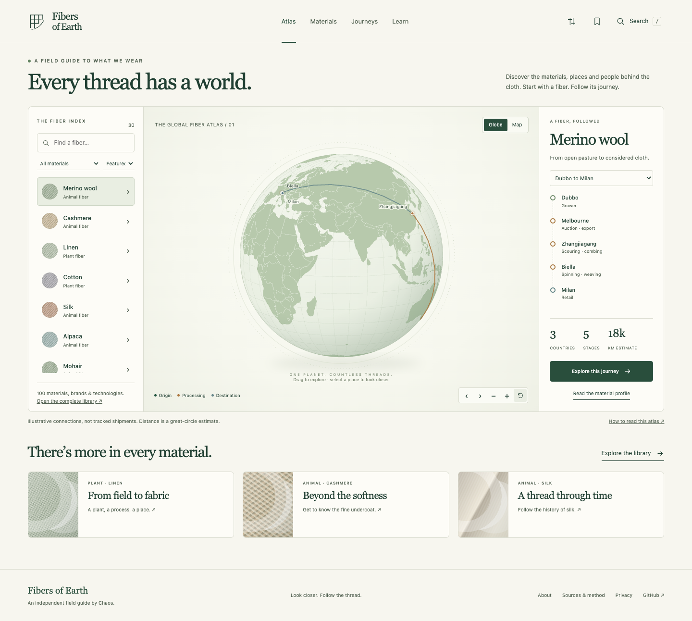
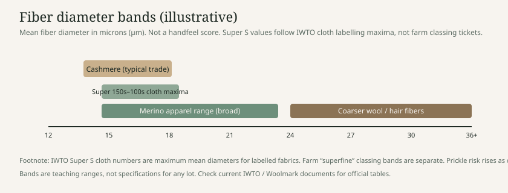
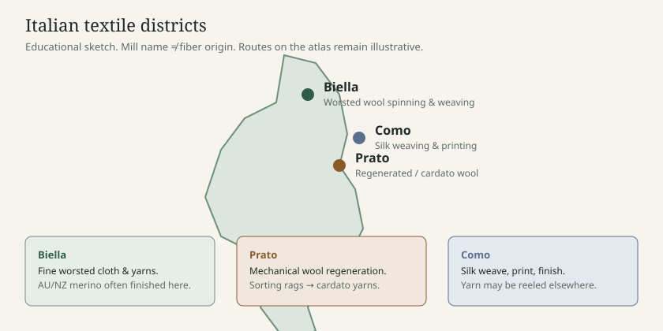
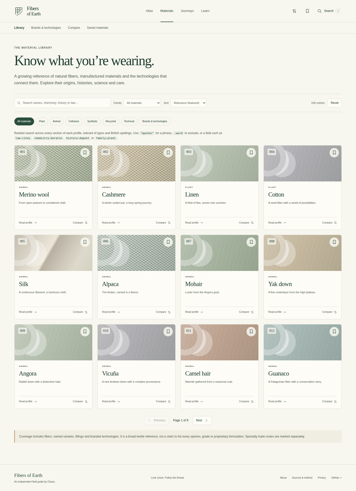
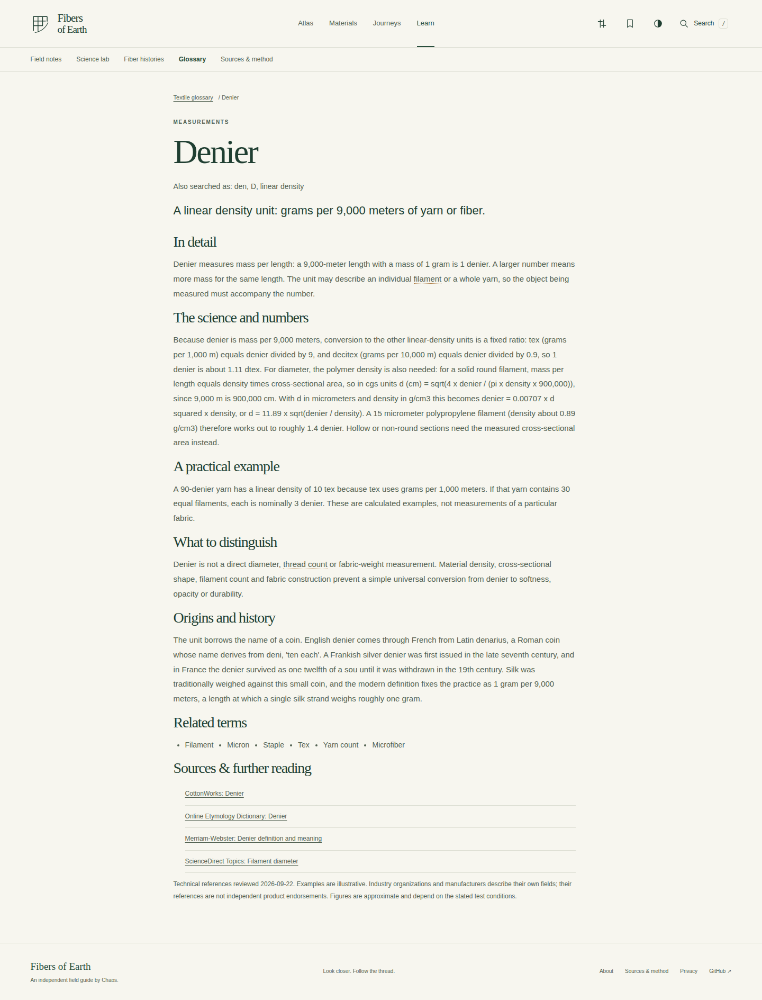
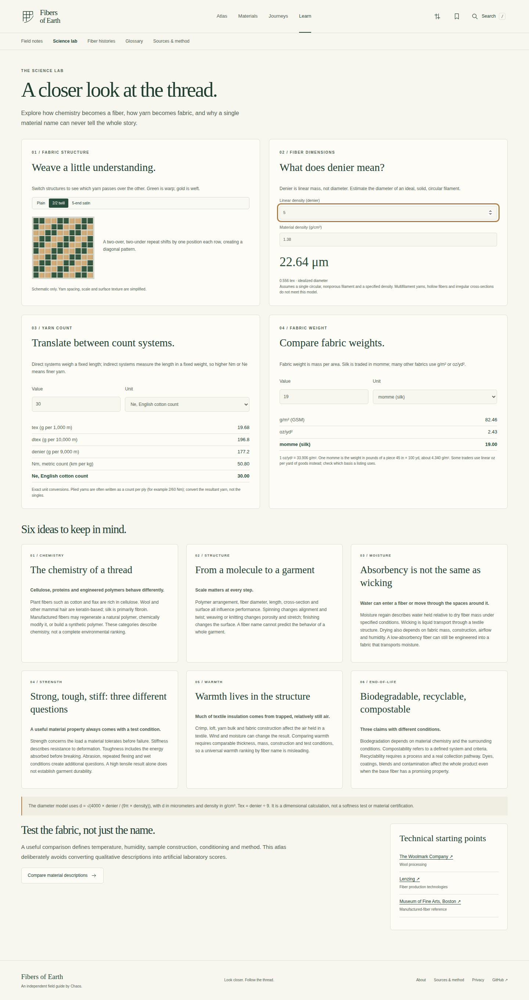
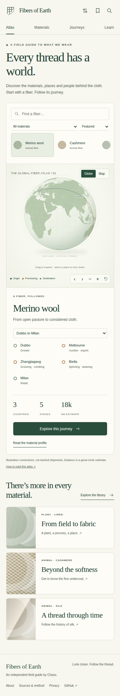
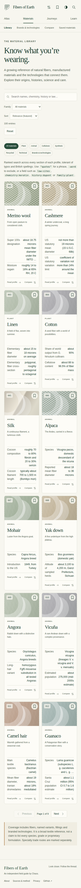
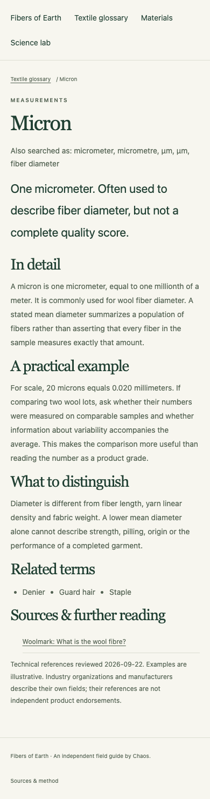

<p align="center"><strong>FIBERS OF EARTH</strong></p>
<h1 align="center">Every thread has a world.</h1>
<p align="center">An independent textile atlas by Chaos.</p>

[](https://github.com/SharpMeow/FibersOfEarth/actions/workflows/check.yml)


[](LICENSE)

Fibers of Earth is an independent textile atlas: 106 material, fiber, and technology profiles, 115 illustrative supply-chain journeys, and the science and history of textiles. It is a static site with no account, API key, or application server.

Fibers of Earth is the independent atlas for what clothes are actually made of: fiber, yarn, cloth, and the words mills and labels use.

It is not a live logistics tracker, supplier directory, or certification body. Routes are educational models. Producer statements are attributed, not independently certified.

Visit the [hosted atlas](https://sharpmeow.github.io/FibersOfEarth/), or build and preview it locally.



<p align="center">
  
</p>

<p align="center">
  
</p>

### Screenshots

| Library | Glossary | Science lab |
| --- | --- | --- |
|  |  |  |

| Atlas (mobile) | Library (mobile) | Glossary (mobile) |
| --- | --- | --- |
|  |  |  |

## Open the atlas

1. Open [sharpmeow.github.io/FibersOfEarth](https://sharpmeow.github.io/FibersOfEarth/) in a modern browser.
2. Or clone this repository, then run:

```sh
npm ci && npm run build && npm run dev
```

3. Open http://127.0.0.1:4173.

The build also writes `dist/offline.html`, a single-file copy that opens without a server (base world map only). External references require a network connection when you choose to open them.

## How it works

| Section | What you can do |
| --- | --- |
| Atlas | Choose from 30 mapped materials. Each globe opens centered on its trade route; raised arcs animate the direction of travel. Zoom with the wheel, pinch, buttons, or keyboard (0.6× to 16×) for finer coastlines, country names, and grids; go full screen; switch to a flat map. |
| Materials | 106 profiles with a reader guide (types and grades, fabrics, buying cues, pros and cons, footprint, care, FAQ, notable facts) and a research layer (structure and chemistry, processing, performance, identification, labeling law, deeper history, key figures, references). Ranked, typo-tolerant search covers every section. Cite in APA or BibTeX, or print the full profile. |
| Brands & technologies | Distinguish 26 proprietary offerings from their underlying fiber, feedstock, or yarn process. |
| Compare | Put three materials side by side across composition, history, care, uses, and sourcing questions. |
| Journeys | Search 115 illustrative routes by place or material; sort by estimated distance or stage count; export a route. |
| Learn | Read nine field notes, 100 historical summaries, and a 102-term glossary with the science, numbers, and origins behind each term. |
| Science lab | Change weave diagrams, calculate ideal filament diameter, and convert yarn counts (tex, dtex, denier, Nm, Ne) and fabric weights (g/m², oz/yd², momme). |
| Saved | Keep a local collection of materials in your browser. |
| Display settings | Reduce motion, enlarge text, raise contrast, or underline links from the header; choices stay in your browser. |

Press `/` to search the atlas. Links preserve views using URL fragments. Browser Back and Forward navigate between sections. Saved items stay on your device.

### Detailed textile glossary

[Read the glossary](https://sharpmeow.github.io/FibersOfEarth/glossary/) or use the interactive glossary to search by aliases and filter by topic or letter. All 102 terms include explanations, the science and numbers, practical examples, distinctions, origins, related terms, and sources. The build creates 103 JavaScript-free glossary pages plus a sitemap for static hosting. [Research and SEO notes](docs/GLOSSARY-RESEARCH.md) explain the source methodology and deployment requirements.

## Coverage and limits

- **Materials catalog:** generic fibers, selected variants, fillings, historical materials, and proprietary technologies. It does not claim to cover every species, polymer grade, trademark, or experimental formulation.
- **Mapped atlas routes:** educational models, **not live shipments or verified supplier relationships**. Markers are approximate cities and regions.
- **Distance figures:** the sum of great-circle segments — not road or shipping distance, and not an emissions calculation.
- **Legacy specialty connections:** inherited from an earlier atlas and labeled as unverified legacy concepts.
- **Producer statements:** attributed in profiles; not independently certified.

See [content methodology](docs/CONTENT.md) and the in-site reference shelf for editorial evidence.

## Privacy

All atlas content and the base map ship with the site. Saved materials and display preferences stay in your browser. There is no account, analytics, advertising, or application backend. Opening the hosted site sends ordinary requests to the host; external reference links visit independent sites under their own policies. See [PRIVACY.md](PRIVACY.md) for storage keys, network behavior, and what never leaves your device.

## Development

Requires Node.js 22 or newer.

```sh
npm ci
npm test
npm run build
npm run dev
```

Open http://127.0.0.1:4173. Rebuild after source changes and restart the preview server. `npm run build` writes the site to `dist/`: a small `index.html`, content-hashed `assets/app-*.js` and `assets/styles-*.css`, the glossary reading edition, the sitemap, on-demand map geometry in `geo/`, and `offline.html`. Build output is not committed; CI builds and deploys it.

For browser and accessibility checks:

```sh
npx playwright install chromium
npm run test:browser
```

The browser command starts its own preview server. To use an installed Chrome instead, set `BROWSER_CHANNEL=chrome`. Test screenshots and a machine-readable report are written to `docs/`.

See [CONTRIBUTING.md](CONTRIBUTING.md), [architecture](docs/ARCHITECTURE.md), [testing notes](docs/TESTING.md), [deployment](docs/DEPLOYMENT.md), [changelog](CHANGELOG.md), and [security policy](SECURITY.md).

## Credits and license

Created by **Chaos**. Original application code and original editorial text are [MIT licensed](LICENSE). Material names and trademarks belong to their respective owners. Reference organizations and material producers are not affiliated with or endorsing this project. Map data and library licenses are documented in [THIRD_PARTY_NOTICES.md](THIRD_PARTY_NOTICES.md). The site is published through GitHub Pages at [sharpmeow.github.io/FibersOfEarth](https://sharpmeow.github.io/FibersOfEarth/). Search indexing is controlled by search engines.
